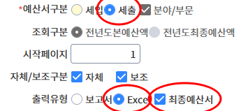

# eHojo BudgetChecker


**e호조 예산·지출집행 현황 자동 병합 프로그램**

e호조에서 내려받은 예산서와 지출집행내역 파일을 자동으로 병합하여,
사업별 예산액·집행금액·잔액을 한눈에 확인할 수 있는 엑셀 파일을 생성합니다.

---

## 주요 기능

- **예산서** (합본예산서, 세출) + **지출집행내역** 파일을 자동 매핑
- 사업별 예산액, 총 집행금액, 잔액을 수식으로 자동 계산
- 집행 내역이 여러 건인 경우 행 병합 처리
- 실행 시점 날짜·시각 기준으로 결과 파일명 자동 생성
  예) `예산집행현황_20260415_143022.xlsx`
- GUI 화면에서 파일 선택 및 실행 — 별도 설치 불필요


---

## 사전 준비 (최초 1회)

### 1. Python 설치

[python.org](https://www.python.org/downloads/) 에서 **Python 3.12 이상** 다운로드 후 설치
> [!WARNING]
> 설치 시 **"Add Python to PATH"** 옵션을 반드시 체크하세요.

### 2. 필요 라이브러리 설치

터미널(명령 프롬프트)에서 프로그램 폴더로 이동 후 실행:

```bash
pip install -r requirements.txt
```

---

## 사용 방법

### 1. e호조에서 파일 내려받기

#### 1-1. 합본예산서(15100) 다운로드


1. **합본예산서(15100)** 이동
2. 부서 선택
3. 예산서구분 → `세출` 선택
4. 출력유형 → `Excel` 선택
5. `최종예산서` 선택 
6. 파일 저장

#### 1-2. 지출집행현황(21126) 다운로드
1. **지출집행현황(21126)** 이동
2. 부서 선택
3. 품의 / 원인행위 / **지출결의** 탭 중 → **지출결의** 클릭
4. 파일 저장

### 2. 프로그램 실행

```bash
python main.py
```

### 3. 파일 선택 및 실행

1. **예산서 파일** → `찾아보기` 클릭 → 내려받은 예산서 파일 선택
2. **지출집행내역 파일** → `찾아보기` 클릭 → 내려받은 집행내역 파일 선택
3. **출력 폴더** → `폴더 선택` 클릭 → 결과 파일을 저장할 폴더 선택
4. **▶ 실행** 클릭
5. 완료 팝업 확인 후 지정 폴더에서 결과 파일 열기

---

## 결과 파일 구조

| 구분 | 내용 |
|------|------|
| 예산 정보 | 회계연도, 부서, 정책/단위/세부 사업명, 편성목, 통계목 등 28개 항목 |
| 산출 내역 | 의무/재량구분, 산출근거명, 산출근거식, 예산구분, 예산액 |
| 사업별예산액 | 해당 사업 예산액 합계 (원 단위) |
| **잔액** | 사업별예산액 − 총지출금액 (자동 계산) |
| **총지출금액** | 집행 결의금액 합계 (자동 계산) |
| 집행 내역 | 결의금액, 지급일자, 적요, 거래처명 등 32개 항목 |

> [!TIP]
> 집행 건수가 2건 이상인 사업은 예산 행이 자동으로 병합됩니다.

---

## 파일 구조

```
eHojo-BudgetChecker/
├── main.py                  # 실행 진입점
├── budget_checker/          # 백엔드 처리 모듈
│   ├── config.py            # 컬럼 정의 설정
│   ├── excel_reader.py      # 엑셀 데이터 조회
│   ├── excel_writer.py      # 결과 엑셀 생성
│   └── checker.py           # 데이터 병합 처리
├── frontend/
│   └── app.py               # GUI 화면
└── assets/
    └── images/              # 안내 이미지
```

---

## 자주 묻는 질문

<details>
<summary><b>실행 시 "No module named" 오류가 납니다.</b></summary>

`pip install -r requirements.txt` 를 다시 실행하세요.

</details>

<details>
<summary><b>결과 파일에 집행 내역이 없습니다.</b></summary>

예산서의 부서코드·사업코드와 집행내역 파일의 코드가 일치하는지 확인하세요.
두 파일 모두 같은 연도·기간 기준으로 내려받아야 합니다.

</details>

<details>
<summary><b>결과 파일을 열면 수식 오류(#REF!)가 표시됩니다.</b></summary>

파일을 열 때 Excel에서 "콘텐츠 사용" 또는 "편집 허용"을 클릭하면 수식이 정상 계산됩니다.

</details>

---

## 개발 환경

- Python 3.14
- xlrd 1.2.0 / xlsxwriter 3.2.9 / customtkinter 5.2.2
